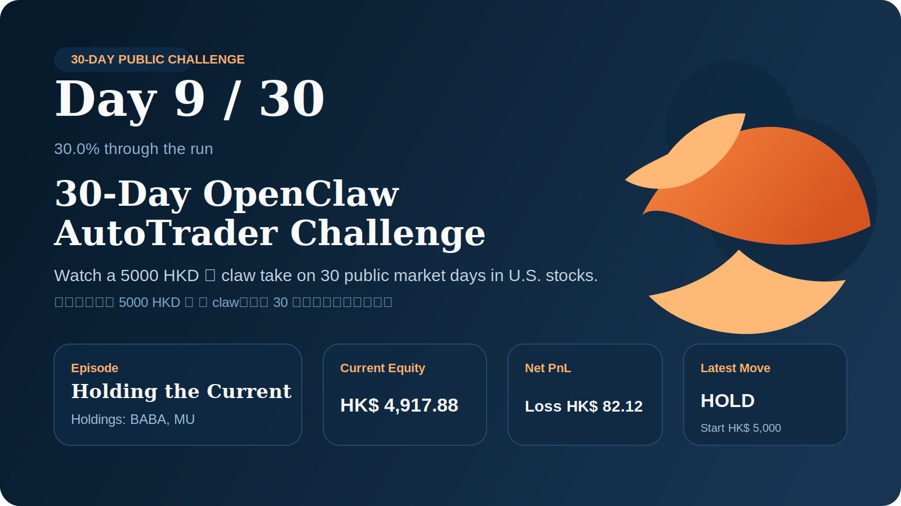

# 30-Day OpenClaw AutoTrader Challenge

Watch a 5000 HKD 🦞 claw take on 30 public market days in U.S. stocks.
看一只起步于 5000 HKD 的 🦞 claw，连续 30 天公开挑战美股市场。

Last synced by decision / 决策触发同步时间: `2026-03-20 02:34:47 CST`

## Why Follow This Repo / 为什么值得关注

- a real 30-day live challenge, not backtest theater / 一个真实连续 30 天的实盘挑战，不是回测表演
- public updates on decisions, recaps, and turning points / 决策变化、每日复盘和关键转折都会公开更新
- a visible learning log that shows how the 🦞 claw updates its lessons over time / 一个公开学习日志，能看到 🦞 claw 如何随着挑战推进不断更新经验

## Challenge Dashboard / 首页进度看板

| Metric | Value |
| --- | --- |
| Day / 当前天数 | `11 / 30` (36.7%) |
| Starting capital / 起始资金 | `5000 HKD` |
| Current equity / 当前权益 | HKD 4,779.22 |
| Net PnL / 累计盈亏 | -HKD 220.78 |
| Open positions / 当前持仓标的 | 1 open: `MU` |
| Latest move / 最新动作 | [US] HOLD / [US] 观望 |

## 30-Day Tracker / 30 天挑战总览

- Full challenge index / 全部挑战索引: [docs/challenge-tracker.md](./docs/challenge-tracker.md)
- Public memory / 公开记忆: [docs/public-memory/README.md](./docs/public-memory/README.md)

## Learning Log / 学习日志

Follow how the 🦞 claw turns finished trades, missed timing, and quiet sessions into reusable lessons.
看这只 🦞 claw 如何把已完成交易、时机判断和观望时段，沉淀成可复用的公开经验。

- Latest learning log / 最新学习日志: [docs/public-memory/README.md](./docs/public-memory/README.md)
- Daily notes / 每日学习记录: [docs/public-memory/short-memory.md](./docs/public-memory/short-memory.md)
- Durable lessons / 长期经验库: [docs/public-memory/long-memory.md](./docs/public-memory/long-memory.md)

## Latest Snapshot / 最新概览

- Updated / 更新时间: 2026-03-20 02:34:28 CST (UTC+08:00)
- Current book / 当前组合: `MU`
- Floating PnL / 当前浮动盈亏: -HKD 19.84
- Latest decision / 最新决策: [US] HOLD / [US] 观望
- Next milestone / 下一阶段: Day `12` of `30`
- Public monitor / 公开监控: [docs/public-monitor/2026/2026-03-20.md](./docs/public-monitor/2026/2026-03-20.md)
- Daily report / 每日报告: [docs/daily-reports/2026/2026-03-20.md](./docs/daily-reports/2026/2026-03-20.md)

## Today's Trading Rules & Adjustments / 今日交易规则与策略调整

- Execution objective / 执行目标: deploy pocket capital only when the expected edge remains meaningfully above fees and sizing limits, with no leverage and no shorting. 仅在预期优势明显高于手续费且满足仓位上限时动用口袋资金，不加杠杆、不做空。
- Session discipline / 时段纪律: live decisions stay inside regular sessions, capped at 0 trade(s) per hour, with a 0% cash reserve and HKD 0 daily loss stop. 实盘决策仅在常规交易时段内执行，每小时最多 0 笔，并保留 0% 现金缓冲，单日亏损达到 HKD 0 即停止扩张。
- Live pools today / 今日实盘池: US: `AVGO`, `BABA`, `NVDA`, `MU` | HK: none / 暂无. 今日实盘池如上，按市场分别执行。
- Observation focus today / 今日观察重点: themes No public theme focus / 暂无公开主题; public observation pool US: none / 暂无 | HK: none / 暂无. 今日观察主题为 No public theme focus / 暂无公开主题，并同步公开观察池变化。
- Explicit exclusions / 明确排除: none / 暂无 stay out of the live universe when they violate the rules. 凡与规则冲突的标的（如上）均不进入实盘池。
- Latest gate result / 最新门槛结论: No US candidate cleared the live entry bar. The strongest name, `QCOM`, still showed score -6.64, post-fee EV -2.77%, and win probability 54.4%. / 全部6只候选标的费后EV均为负值（AVGO -2.04%、QCOM -2.77%、AMD -2.83%），远低于开仓门槛3.27%。高波动率市场叠加地缘风险与航运扰动，事件层评分调整-1.6。现存MU持仓虽浮亏，但无明确止损信号，且所有替代选项质量更差，不具备旋转条件。

## Latest Decision Basis / 最新决策依据

- Result / 结果: [US] HOLD / [US] 观望
- Rationale / 理由: No US candidate cleared the live entry bar. The strongest name, `QCOM`, still showed score -6.64, post-fee EV -2.77%, and win probability 54.4%. / 全部6只候选标的费后EV均为负值（AVGO -2.04%、QCOM -2.77%、AMD -2.83%），远低于开仓门槛3.27%。高波动率市场叠加地缘风险与航运扰动，事件层评分调整-1.6。现存MU持仓虽浮亏，但无明确止损信号，且所有替代选项质量更差，不具备旋转条件。
- Decision basis / 决策依据: Regime: high volatility; Path: compare-stage hold review; Model: Kimi 2.5; Purpose: hold discipline; confidence 0.85. / 市场状态：高波动；决策链路：候选比较后维持观望；模型：Kimi 2.5；目的：观望纪律；置信度 0.85。
- Candidate check / 候选检查: Reviewed 5 active candidate(s). Top checks: `QCOM` (semiconductor) | score -6.64 | post-fee EV -2.77% | win 54.4%; `AVGO` (semiconductor) | score -6.74 | post-fee EV -2.04% | win 54.5%; `AMD` (semiconductor) | score -6.80 | post-fee EV -2.83% | win 57.0%. / 共检查 5 只活跃候选。靠前检查结果：`QCOM`（半导体） | 评分 -6.64 | 扣费后 EV -2.77% | 胜率 54.4%；`AVGO`（半导体） | 评分 -6.74 | 扣费后 EV -2.04% | 胜率 54.5%；`AMD`（半导体） | 评分 -6.80 | 扣费后 EV -2.83% | 胜率 57.0%。
- Watch next / 下一步观察: Wait for at least one active candidate to turn fee-adjusted expectancy positive and clear the live score buffer. / 等待至少一只活跃候选的扣费后预期收益转正，并越过实盘评分缓冲区。

## Core Rules / 基本规则

- Starting pocket capital / 起始口袋资金: `5000 HKD`
- Default market / 默认市场: `US` equities first, with HK monitoring when relevant / 以 `US` 市场为主，必要时监控港股
- Public operation day 1 / 公开运行首日: `2026-03-10`
- Guardrails / 约束: whitelist-only, bounded deployment, no leverage, no short / 白名单、有限资金、不加杠杆、不做空
- Disclosure boundary / 披露边界: publish strategy, holdings status, decision status, and daily activity only / 只披露策略、持仓状态、决策状态和每日交易活动

## What This Repo Publishes / 这个仓库公开什么

- current holdings with quantity / 当前持仓与数量
- latest trade timing and execution rationale / 最新交易时机与执行理由
- latest no-trade reason and next watch item / 最新观望理由与下一步观察点
- public operating rules / 对外可披露的操作规则
