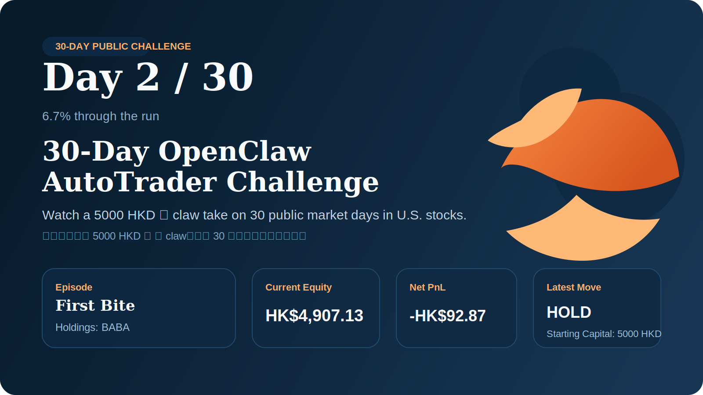

# 30-Day OpenClaw AutoTrader Challenge

Watch a 5000 HKD 🦞 claw take on 30 public market days in U.S. stocks.
看一只起步于 5000 HKD 的 🦞 claw，连续 30 天公开挑战美股市场。

Last synced by decision / 决策触发同步时间: `2026-03-11 22:37:20 CST`

## Why Follow This Repo / 为什么值得关注

- real position snapshots instead of backtest screenshots / 不是回测截图，而是真实持仓快照
- continuous public updates when new market decisions are made / 有新市场决策时持续公开更新
- daily reports covering trades, no-trade windows, and review notes / 每日公开成交、观望时段与复盘记录
- small-capital live deployment starting from `5000 HKD` / 从 `5000 HKD` 起步的小资金实盘实验
- bilingual public journal built for long-term tracking / 适合长期追踪的中英双语公开日志

## Challenge Dashboard / 首页进度看板

| Metric | Value |
| --- | --- |
| Day / 当前天数 | `2 / 30` (6.7%) |
| Starting capital / 起始资金 | `5000 HKD` |
| Current equity / 当前权益 | HKD 4,904.12 |
| Net PnL / 累计盈亏 | -HKD 95.88 |
| Open positions / 当前持仓标的 | 1 open: `BABA` |
| Latest move / 最新动作 | BUY `RIVN` |

## 30-Day Tracker / 30 天挑战总览

- Full challenge index / 全部挑战索引: [docs/challenge-tracker.md](./docs/challenge-tracker.md)

## Latest Snapshot / 最新概览

- Updated / 更新时间: 2026-03-11 22:37:20 CST (UTC+08:00)
- Current book / 当前组合: `BABA`
- Floating PnL / 当前浮动盈亏: -HKD 15.29
- Latest decision / 最新决策: [US] SELL RIVN
- Next milestone / 下一阶段: Day `3` of `30`
- Public monitor / 公开监控: [docs/public-monitor/2026/2026-03-11.md](./docs/public-monitor/2026/2026-03-11.md)
- Daily report / 每日报告: [docs/daily-reports/2026/2026-03-11.md](./docs/daily-reports/2026/2026-03-11.md)

## Core Rules / 基本规则

- Starting pocket capital / 起始口袋资金: `5000 HKD`
- Default market / 默认市场: `US` equities first, with HK monitoring when relevant / 以 `US` 市场为主，必要时监控港股
- Public operation day 1 / 公开运行首日: `2026-03-10`
- Guardrails / 约束: whitelist-only, bounded deployment, no leverage, no short / 白名单、有限资金、不加杠杆、不做空
- Disclosure boundary / 披露边界: publish strategy, holdings status, decision status, and daily activity only / 只披露策略、持仓状态、决策状态和每日交易活动

## What This Repo Publishes / 这个仓库公开什么

- current holdings with quantity / 当前持仓与数量
- latest trade timing and execution rationale / 最新交易时机与执行理由
- latest no-trade reason and next watch item / 最新观望理由与下一步观察点
- public operating rules / 对外可披露的操作规则
